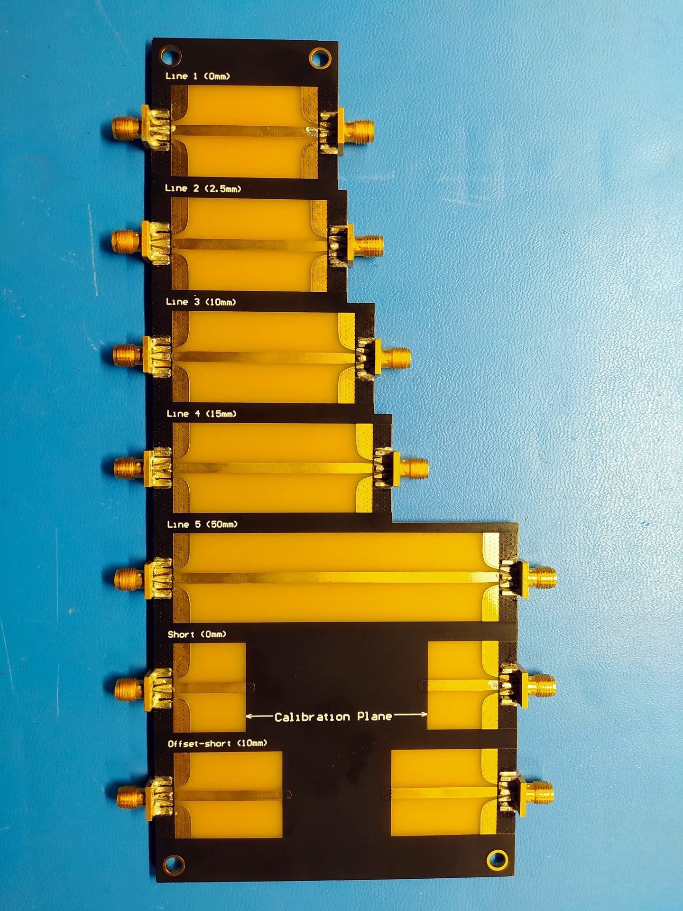
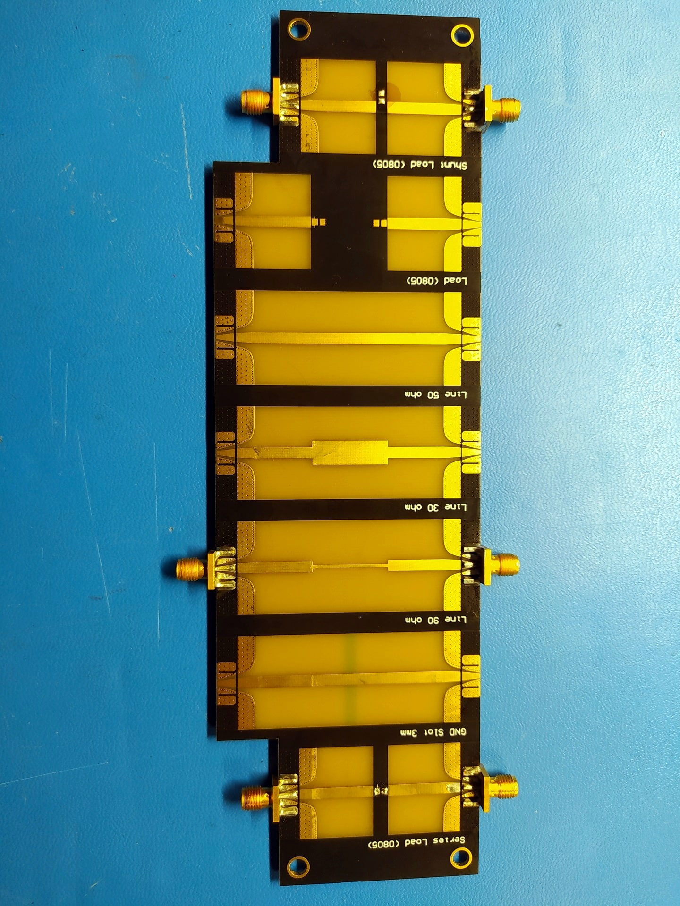
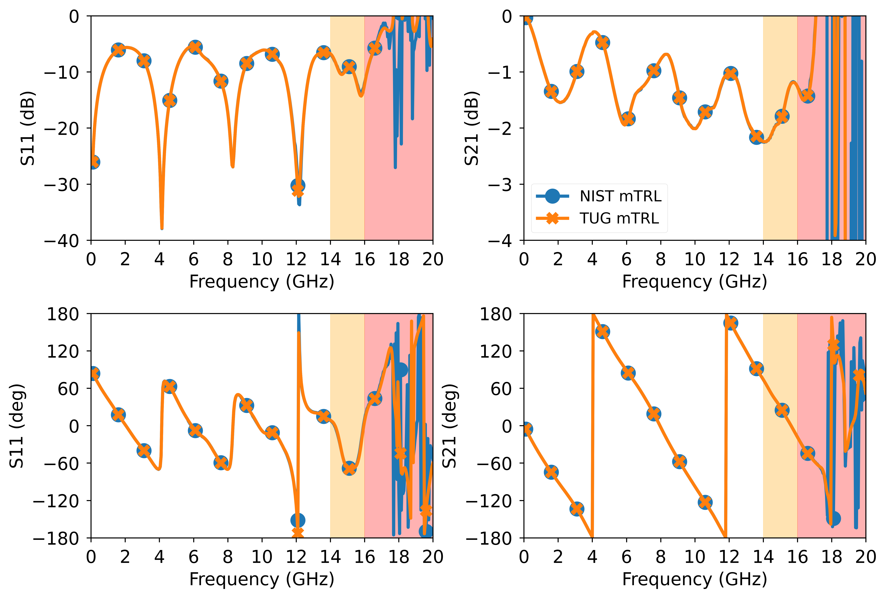
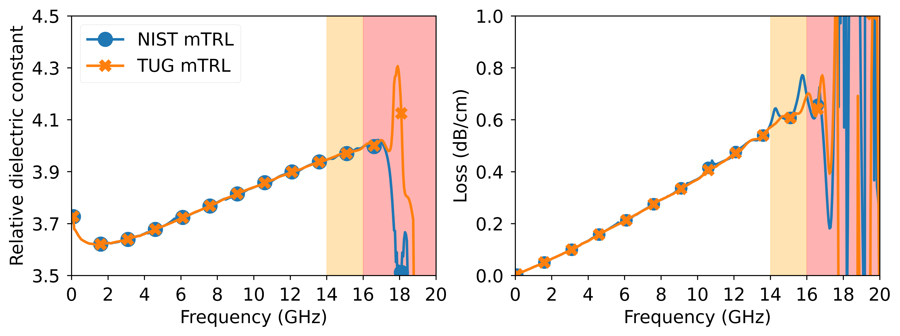

# FR4 microstrip multiline TRL board

Originally, I designed a transition from SMA connector to microstrip line for my own usage. However, I found myself afterwards creating a multiline TRL board on the standard 1.6mm FR4 substrate. So I thought maybe someone would find it useful to de-embed measurements of some DUTs. In this repository, you will find the CAD files (Altium and Gerber) for a multiline TRL PCB and another PCB that contains some example DUTs.

The standards in the multiline TRL board are as follows:

- Five microstrip lines (50 ohm) with lengths (relative to the first line) of {0, 2.5, 10, 15, 50} mm.
- Two symmetric short standards with offsets of {0, 10} mm.

For the DUT board, you will find:

- 0805 SMD pads for any one-port loads.
- 0805 SMD pads for a series load.
- 0805 SMD pads for a shunt load.
- A matched line. Width = 2.94mm (50 ohm).
- A wide stepped impedance line. Width = 6.39mm (30 ohm).
- A narrow stepped impedance line. Width = 0.88mm (90 ohm).
- A matched line with a slot in the ground plane.

 | 
:--: | :--:
*mTRL board.* | *DUTs board.*

*I ordered the PCBs at [JLCPCB](https://jlcpcb.com/) with their standard 2 layers 1.6mm FR4 substrate. The SMA connector used is the [Johnson 142-0701-801](https://www.belfuse.com/product/part-details?partn=142-0701-801)*

## Measurements

I used an R&S ZVA to measure from 100 MHz to 20 GHz. After processing the data, I observed that the microstrip lines operate stably up to 14 GHz. The data between 14GHz and 16 GHz is somewhat acceptable (yellow region), but data after 16GHz is garbage (red region).

Below is the calibrated 90 ohm stepped impedance line and the extracted relative dielectric constant and loss per unit length. The multiline TRL code used in this repository is taken from my other [repository on multiline TRL](https://github.com/ZiadHatab/multiline-trl-calibration).

*Calibrated stepped impedance line 90 ohm.*

*Extracted relative dielectric constant and loss per unit length.*
